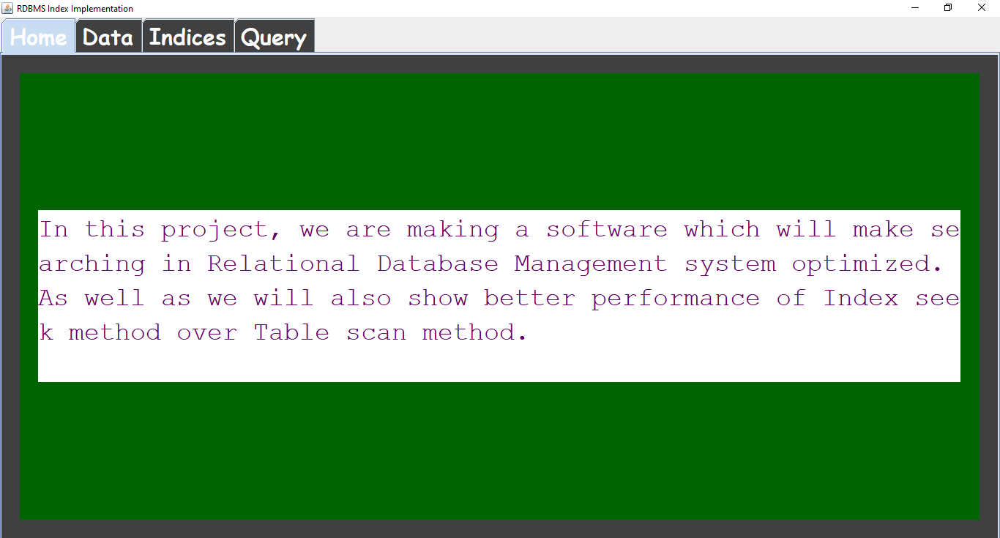
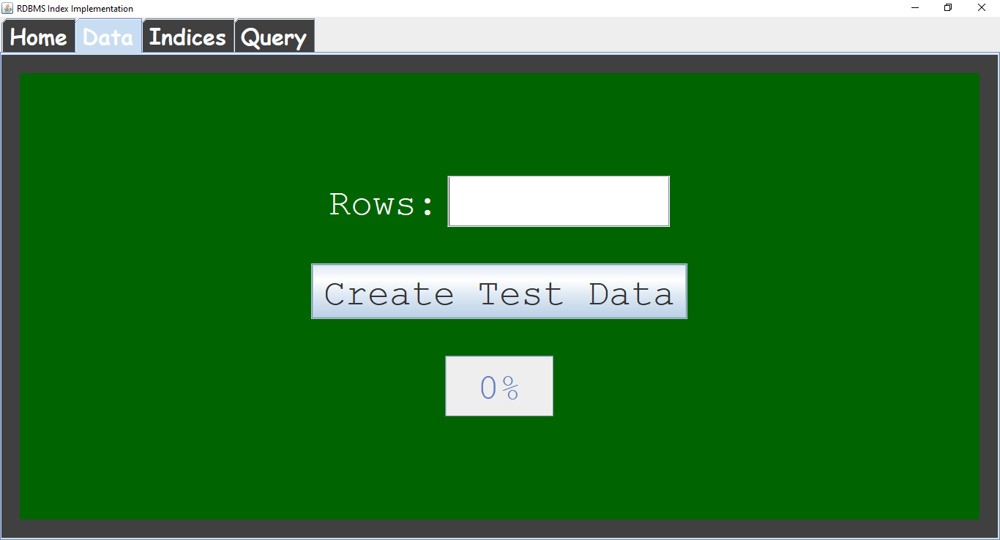
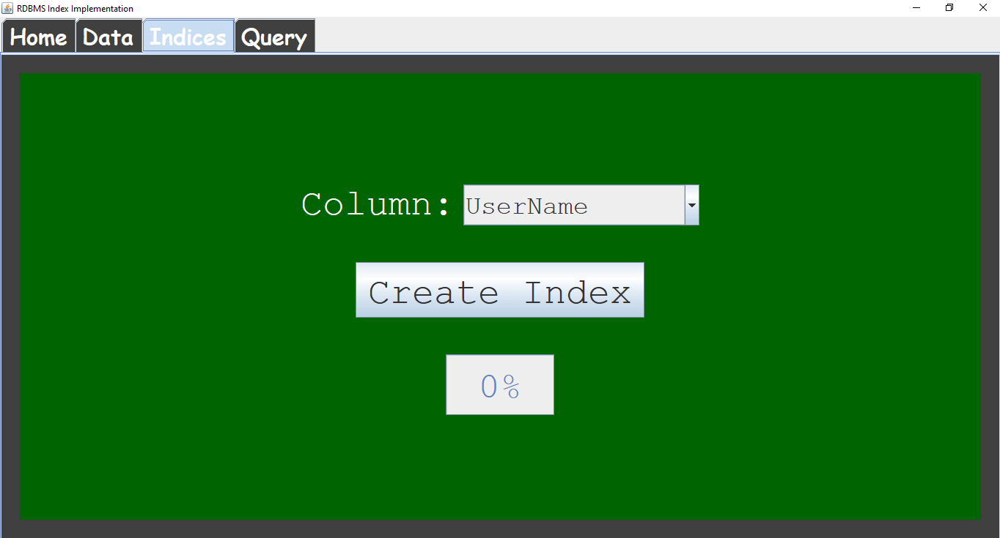
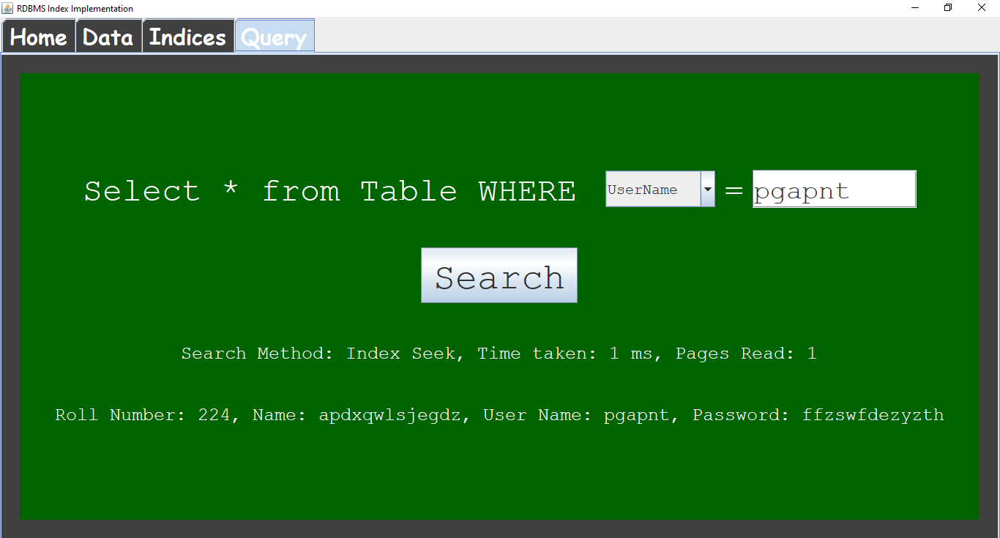

# Binary-Search-Implementation
Java Project(software which will make searching in Relational Database Management system optimized)

## Summary
### About
  In this project, we are making a software which will make searching in Relational Database Management system optimized. As well as we will also show better performance of Index seek method over Table scan method.
### Goal 
  To Implement Btree Searching algorithm in File system Searching.
  And Differntiate which is better in performance

We have 4 tabs in our project->
1.	Home
2.	Data
3.	Indices
4.	Query

A.	Home Tab
 
  •	Tab in which we are describing our project for what purpose this can be implemented.

B.	Data Tab
  •	To create our test Data.
  •	In which we are generating our random data to use it as raw data in project.
  •	The output data is of combination of serial no, Name, Username, Password.

C.	Indices
  •	Tab in which we will Index Our Data According to Name, UserName, Password respectively as per our requirement.

D.	Query
  •	In this tab we will test our project as per requirement
  •	We calculate search time in Database searching 
  i.	Before Indexing
  ii.	After Indexing
  
### Conclusion
  Search Time after indexing is much lesser than before indexing
  
## Technology used
Java Swing

## ScreenShot

## Getting Started

1.	Create a folder named Data in D drive
2.	Open Project directory using CMD
3.	Execute followind command
a.	javac Client.java
b.	java Client D:/Data
4.	Go to data Tab
5.	Enter how Many data you want to create says. 5000
6.	Click Create Test Data.
7.	 Go to Query Tab and search any result among data created in D:/Data
8.	Calculate Time for which it used to search data
9.	Then GO to Indices Tab
10.	Create Index using Respective Entity
11.	Then again Go to Query Tab and search for the same previous  data
12.	Calculate Time for which it used to search data.
Then you can notice that There is large gap between two search time

## Authors

* **Praveen Kumar Sharma** - *Initial work* - [Praveen Kumar Sharma](https://github.com/Praveen101997)

See also the list of [contributors](https://github.com/Praveen101997/Binary-Search-Implementation/contributors) who participated in this project.

## License
